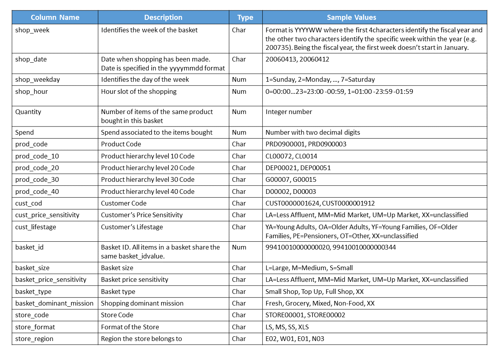

# Customer Single View

### Definition

Customer Single view is a set of information which gather all the data about the customer for example their personal data, their sales transaction and processing into single view

Customer single view can create in a customer data platform (CDP) to centralize all user information and make it available across the related teams in the company to query and analysts

### Benefit
- Understand customer better on their profile, purchasing behavior etc. 
- Helps to make better customer relationships by providing consistent interactions across touchpoints and departments that meet the need of customer

### Example of creating a customer single view from supermarket's data

**Data:** [supermarket.parquet](./supermarket.parquet)

**Dataset overview**
The dataset is the sales transactions data of a supermarket from year 2006 to 2008 and the details of the data are as per the table below.

This data includes member and non-memer transactions, so in this example will focus on member transaction only.
![Dataset_Details]

**Sanity check and clean raw data**
 This dataset consists of 956K rows and 22 columns
